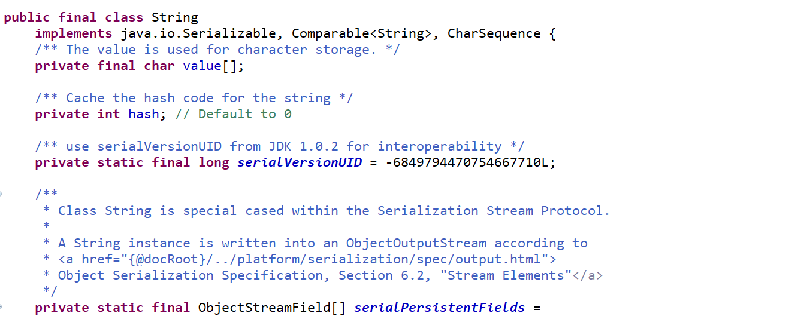

## StrUtil之isEmptyIfStr()方法解析

方法内容:
```
	public static boolean isEmptyIfStr(Object obj) {
		if (null == obj) {
			return true;
		} else if (obj instanceof CharSequence) {
			return 0 == ((CharSequence) obj).length();
		}
		return false;
	}

```

首先此方法是静态的，以static作为修饰符，通常用static修饰的方法不需要实例化就可以通过类名.方法名调用。
实例化，通俗地讲就是new一个对象。

这个方法作用如下:
(1)拿到一个对象，判断其是否为null，如果为null，返回值则为true，否则继续下一个else if判断;
(2)判断该对象是否是字符序列类型;
(3)if和else if条件都不符合，就直接返回false;

instanceof是Java的关键字，主要作用就是判断该对象是不是这种类型。

应用场景:
以登录为例，通过传递该用户的邮箱或者手机编号到后台服务端程序，服务端程序调用对应的业务方法处理，判断该手机编号对应的用户信息是否存在，如果存在则返回false,否则为true。

举例说明:
在Java中所有类的父类均为Object

代码如下:
```
	@Test
	public void testName() throws Exception {
		

       SysUser user = new SysUser();
       System.out.println(user instanceof Object);
	   


	}

```
最终的输出结果为true。

这段代码我不太明白是什么意思
```
return 0 == ((CharSequence) obj).length()

```

不过从最终返回为0，对应的Int值为false，也就说明它是一个对象。

参考某篇博客这样说，说CharSequence是一个字符序列，String继承于CharSequence。
但是我通过查看源码发现String并没有继承CharSequence，而是实现CharSequence这个接口，如图所示:



